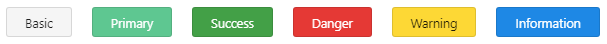

# Button Colors

The Truly-UI buttons are styles for actions in forms, dialogs, and more with support for multiple sizes, states and many properties for customization



jhjhkhjkjh



```markup
<tl-button [text]="'Basic'" [color]="'basic'"></tl-button>
<tl-button [text]="'Primary'" [color]="'primary'"></tl-button>
<tl-button [text]="'Success'" [color]="'success'"></tl-button>
<tl-button [text]="'Danger'" [color]="'danger'"></tl-button>
<tl-button [text]="'Warning'" [color]="'warning'"></tl-button>
<tl-button [text]="'Information'" [color]="'information'"></tl-button>
```







